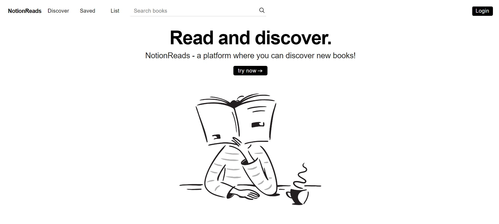
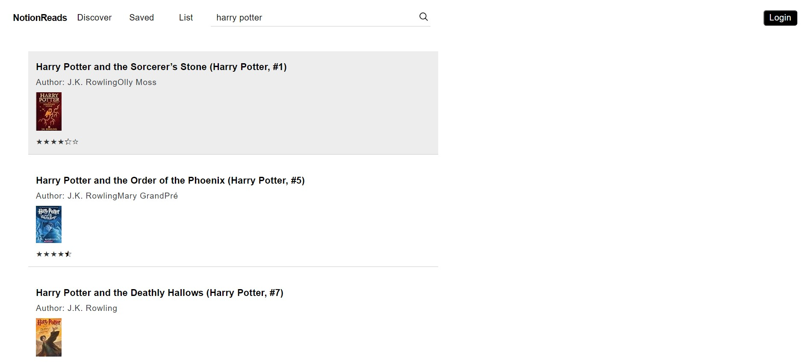

# NotionReads

Welcome to NotionReads! This project aims to create a simplified and improved version of Goodreads, utilizing React, TypeScript, and Vite for both web and mobile platforms. This project seeks to reimagine the book browsing and management experience, drawing inspiration from the intuitive and minimalist design of Notion.

**Note: This project is currently in progress and under active development.**

## Why Notion as UI Inspiration?

The UI design of Notion offers a clean, user-friendly, and less cluttered approach to information organization. Taking cues from Notion's simplicity, my aim is to provide users with an uncluttered, visually pleasing, and intuitive interface for managing their book collections, discovering new reads, and interacting with the platform seamlessly.

**NotionReads** adopts this design philosophy to streamline the browsing, saving, and exploring of books, ensuring a more user-centric and less overwhelming experience compared to traditional book management platforms.

## Why NotionReads?

The name **NotionReads** is a nod to the project's design inspiration from Notion and its vision to revolutionize the way readers interact with their book collections. By blending the simplicity of Notion's interface with the functionalities of a book management system, **NotionReads** aims to offer a more intuitive and elegant solution for book enthusiasts.

## Table of Contents

- [Features](#features)
  - [Search Feature](#search-feature)
  - [Discover](#discover)
  - [Saved](#saved)
  - [List](#list)
- [Display](#display)
  - [Screenshots](#screenshots)
- [Build](#build)

## Features

### Search Feature
NotionReads offers a robust search functionality allowing users to find any author, book, genre, or ISBN, simplifying the book discovery process.

### Discover
Discover new books with ease through tailored recommendations and personalized suggestions, making book exploration delightful.

### Saved
Users can conveniently access and manage their saved books, ensuring easy tracking of their reading lists.

### List
Explore curated lists of books categorized by themes such as "Best Books Ever," "Best Young Adult," and more, providing users with diverse reading options.

## Display

### Screenshots

## Build

Stay tuned for detailed build instructions and deployment guidelines as the project progresses.

